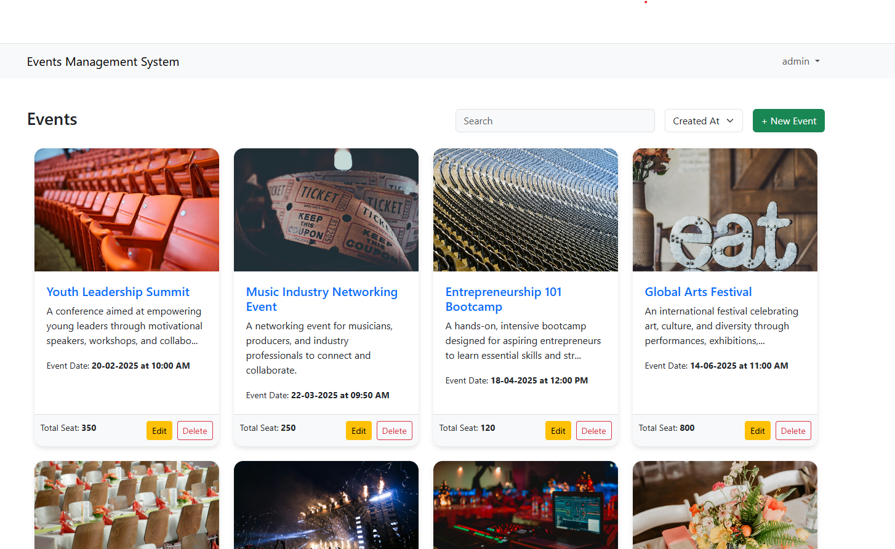
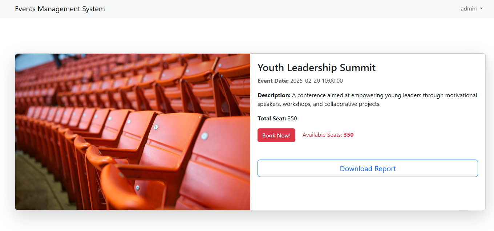

# Event Management System

This project allows you to create, manage, view events with individual as well as register attendees and generate CSV reports.

## Features
- User authentication.
- Event management. 
- Attendee registration. 
- Generate Report.

## Prerequisites
- PHP 8.2 or higher
- MySQL database
- jQuery for frontend interactions
- Bootstrap for basic styling

## Installation

First copy this project in to your ***htdocs or www*** folder of the local server. Then,

### 1. Database Credentials Setup

Go to the database directory and change database credentials in **database.php** file as well as import the sql file into you local server.

### 2. Startup

Open your web browser and navigate to the local server URL, such as **http://localhost**. If everything is set up correctly, the login page will appear.

**Also visit our website at:** [https://eventmanager.poraoo.com/](https://eventmanager.poraoo.com/)

### 3. Credentials

***For User:***

- **Email:** user@gmail.com  
- **Password:** 123456789  

***For Admin:***

- **Email:** admin@gmail.com  
- **Password:** 123456789

## Project Overview

### Event Dashboard

- After logging in, you will be directed to the dashboard, where all events are displayed with pagination. You can easily filter events by using the search or sort functions. To create a new event, simply click on the **"New Event"** button.

- By clicking on the event name, you'll be directed to the event details page. There, you'll find comprehensive information about the event, including a detailed description, the number of remaining seats, and the option to book your tickets by selecting seats. To make a reservation, simply click the 'Book Now' button. Additionally, only the admin has the ability to generate an event report, accessible by clicking the blue button.

### Technical Details

- **Event Modification and Deletion**: 
  - Only the user who created an event can modify or delete it.
  - Other users do not have access to modify someone else's event, except for admins who have full permissions.
  
- **Event Booking**: 
  - Any user can book an event multiple times for the same or different quantities, as long as there are available seats.

- **CSV Report Generation**: 
  - Only admins have the privilege to generate CSV reports for each event, providing valuable data on event details and bookings.

- **User Sessions and Authentication**: 
  - When a user logs in, their information is stored in server-side sessions.
  - A token is generated to validate AJAX requests, ensuring secure interactions.

- **Password Encryption**: 
  - User passwords are encrypted during registration to enhance security and protect sensitive data.

- **Database Queries**: 
  - All database queries are executed through a custom query class that uses prepared statements, ensuring safe and efficient query execution.

### API Documentation

- **Authentication**: 
  - The API uses a bearer token to retrieve event details. To get the token, first login by sending a POST request to the following URL:  
    `http://localhost/events_management_system/inc/api.php` (for localhost).
  - In the body of the request, include your email, password, and `action=api-event` as parameters.

- **Get Token**: 
  - After logging in, you will receive a token in the response.

- **Get Event Details**: 
  - To retrieve the details of a specific event, set the token as the bearer token in your request header.
  - Then, send a GET request to the following URL:  
    `http://localhost/events_management_system/inc/api.php?action=api-event-details&id={eventId}`  
    Replace `{eventId}` with the actual event ID to get the event details.

### Future Works

- **Image Compression**: 
  - Currently, images are not being compressed for faster loading. We can implement image compression techniques to enhance performance and reduce load times.

- **Dynamic Pagination**: 
  - The pagination is currently set to show 8 events per page permanently. We can make this dynamic, allowing users to customize the number of events displayed per page.
